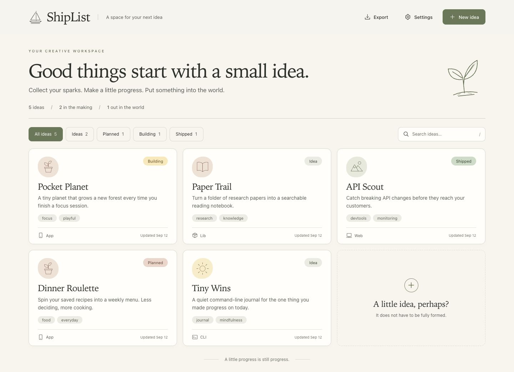

# ShipList

**A home for your next idea — and the ones you actually ship.**

English · [简体中文](https://github.com/chloeh-1379/shiplist/blob/main/README.zh-CN.md)

An app you keep thinking about. A weekend experiment. A tool you wish existed.
Give it a place to start, keep the next step in sight, and watch it become something real.



*The real ShipList interface, with fictional ideas for illustration. Your own workspace starts empty.*

**Local & offline · No account · Your files, your folder · Free & open source**

## From “what if” to “it’s live”

- **Catch an idea before it disappears.** Start with just a title. Add a short pitch, notes, links, and a few tags whenever you’re ready.
- **See what you’re making.** Browse your ideas as cards, filter by progress, or search across titles, notes, and tags. Set a priority from 0 to 5 in the editor; cards show it as stars.
- **Give each project a next step.** Open an idea to keep its plan, useful links, and progress updates together. Notes support headings, lists, and other Markdown formatting.
- **Keep a record of what you ship.** Move from **Idea → Planned → Building**, then mark a project **Shipped**, **Released**, or **Sold**. Add the repo, website, or store link so you can find it again.
- **Make room for a change of plan.** Use **Parked** for “not right now” and **Stopped** for projects you’ve decided to end. The notes and history stay with them.
- **Take your ideas with you.** Export a readable Markdown collection to share, or a complete JSON copy to back up. Your ideas live in a local folder you choose.

## Start your workspace

You’ll need [Node.js](https://nodejs.org/) 18 or later. Then run:

```bash
git clone https://github.com/chloeh-1379/shiplist.git
cd shiplist
node server.js
```

Open **[localhost:4520](http://127.0.0.1:4520)** in your browser and choose **New idea**.
No packages to install, no account to create. Keep the terminal running while you use ShipList.

On macOS, you can also double-click **start.command** in the downloaded project folder to start it and open the page.

## Make it yours

**Start small.** A name is enough. Choose where you’d like to ship — an app, website, GitHub repo, command-line tool, library, or something else. Fill in the details as the idea takes shape.

**Update a project’s status.** Open its card, choose **Edit idea**, then select **Status** and save. All eight statuses are available here and in **New idea**. Use **Shipped** when the code is published, **Released** when it is available to users, and **Sold** when the project has been sold.

The home page always shows **All ideas**, **Ideas**, **Planned**, **Building**, and **Shipped** filters. **Released**, **Sold**, **Parked**, and **Stopped** appear when at least one project has that status. These are filters for existing projects; change a project’s status in its editor.

**Pick a folder.** Open **Settings** to see or change where your ideas are saved. The default is `~/ShipList/ideas.json`. Back up that folder like any other important file. If you choose a folder with no existing ideas file, ShipList copies your current ideas there.

**Share what you’ve been working on.** Open **Export** at the top of the page, then choose **Markdown** for reading and sharing, or **JSON** for a full data copy.

A few shortcuts: **/** to search, **Esc** to close a dialog or leave editing, and **⌘/Ctrl + Enter** to save while editing.

## Bring your AI assistant along

Ideas often start in a conversation. With the included [ShipList skill](./skills/shiplist/SKILL.md) installed in a compatible coding assistant, you can ask it to save the idea while it’s fresh:

> “Save this idea to ShipList, with the first version we just discussed.”
>
> “Mark Pocket Planet as building and log today’s progress.”
>
> “We shipped it. Add the repo link and update the status.”

Your assistant and the app work with the same local collection. You can also export your ideas as Markdown and share them in a conversation.

## A few things to know

ShipList runs on your computer and works offline once you have Node.js and the project. It has no built-in cloud sync or team accounts. The app interface is currently in English; this guide is also available in [简体中文](https://github.com/chloeh-1379/shiplist/blob/main/README.zh-CN.md).

Want to customize it or connect your own tools? See the [developer guide](./docs/DEVELOPMENT.md) for launch options and the [agent/API reference](./AGENTS.md) for integrations.

[MIT license](./LICENSE). Made for the things you want to make.
